# Graph anatomy

 Git is based on a data structure concept called "Directed Acyclic Graph" (DAG) (German: "gerichteter azyklischer Graph")

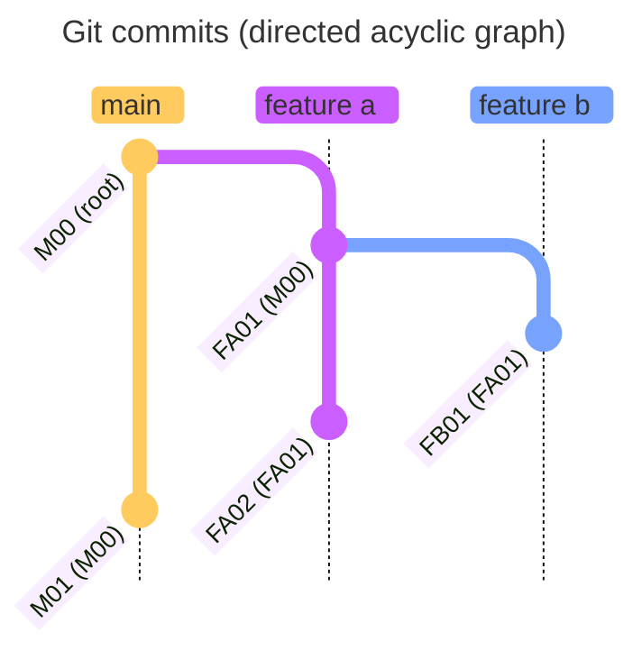

# Commit anatomy

A commit encapsulates the changes to the files since the last commit. It records what was added, removed, or modified in the project.

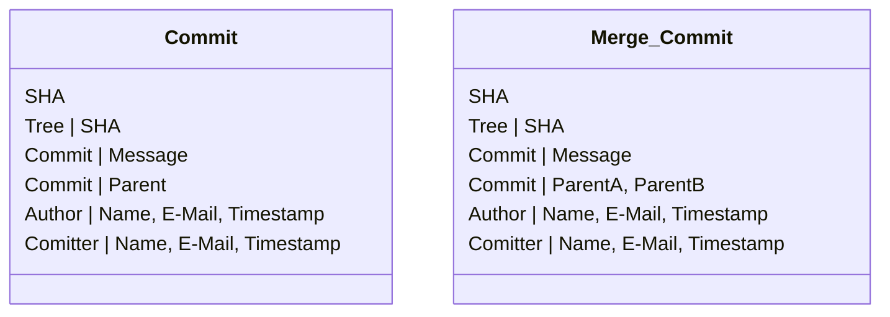

The SHA of a commit is build from the following information

```
tree <TREE-SHA>
parent <PARENT1-SHA>   # Only if there are parent commits
parent <PARENT2-SHA>   # Only if a merge commit
author <AUTHOR-NAME> <AUTHOR-EMAIL> <AUTHOR-TIMESTAMP>
committer <COMMITTER-NAME> <COMMITTER-EMAIL> <COMMITTER-TIMESTAMP>

<COMMIT-MESSAGE>
```

# Node, Commit, SHA

A node, called a 'commit' in git, represents a specific state or snapshot of the repository. A node is represented by its SHA.

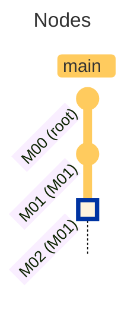

# Tag, Branch, Stash

Technically, a tag, a branch, and a stash are all the same: 

An alias (pointer) to a  particular snapshot (commit, identified by its SHA) of the repository

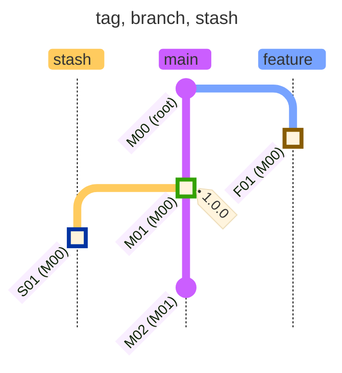

But each serves a different purpose: Tags mark fixed points in history, branches track ongoing development and stashes temporarily save uncommitted changes

# Pull

A `git pull` internally fetches changes from remote (`git fetch`) and integrate (merge) them afterwards into your local branch (`git merge`).

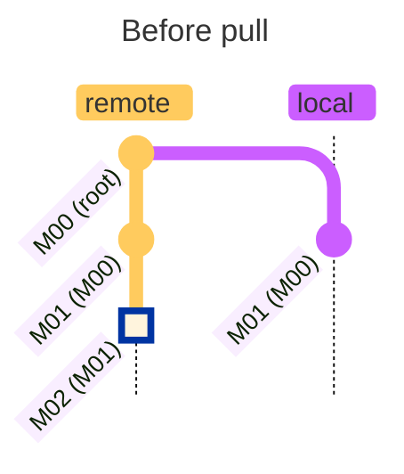

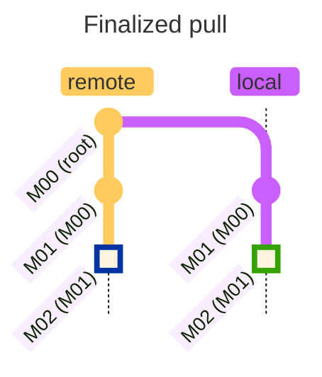
# Merge (fast-forward)

Merge branch `feature` into `main` (using `fast-forward` strategy)

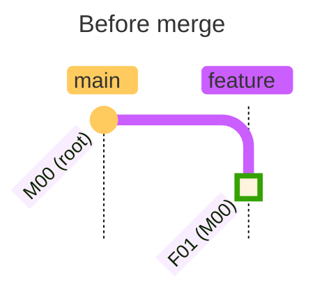

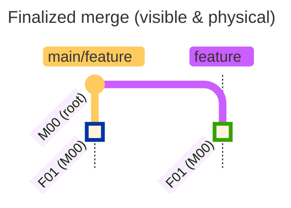

Technically, the pointer to the latest commit of `main` branch is set to the latest commit of `feature` branch.

# Merge (recursive)

Merge branch `feature` into `main` (using `recurive` strategy)

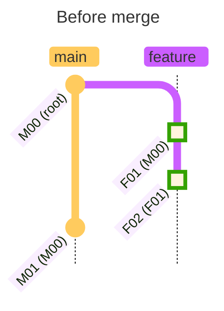

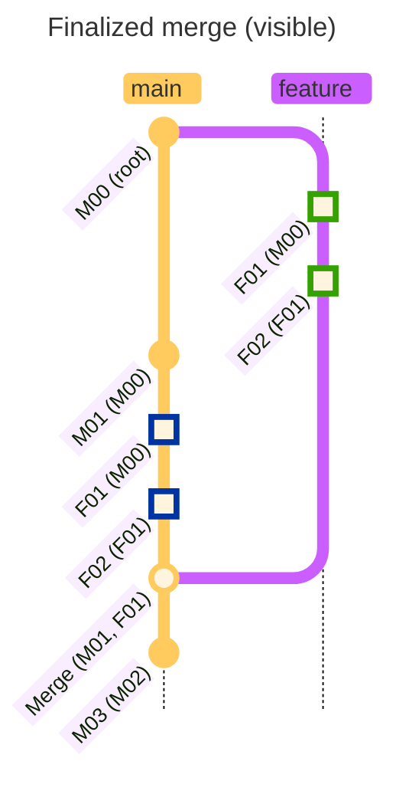

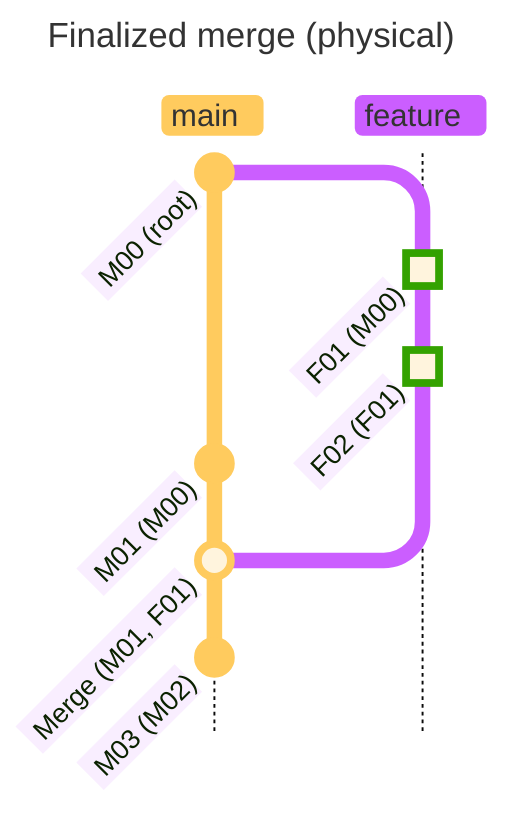

Technically

* Changes to files of **all** commits on `feature` branch are applied to `main` branch
* merge conflicts are resolved (either automatically or by user)
* a **single** merge commit with 2 parents is created on branch `main`

# Cherry picking

Cherry pick commits `M01` and `M02` from `main` to `feature` branch

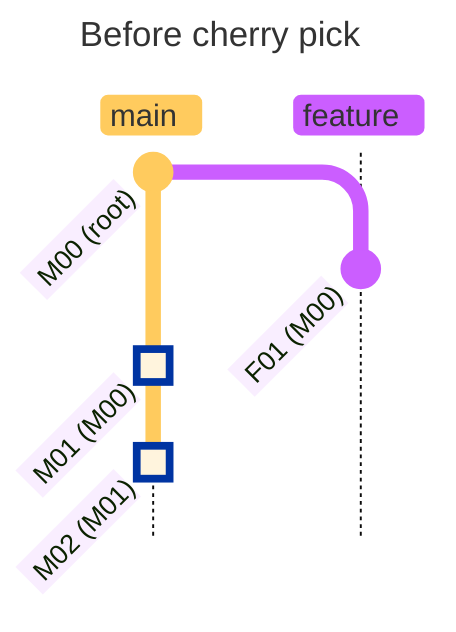

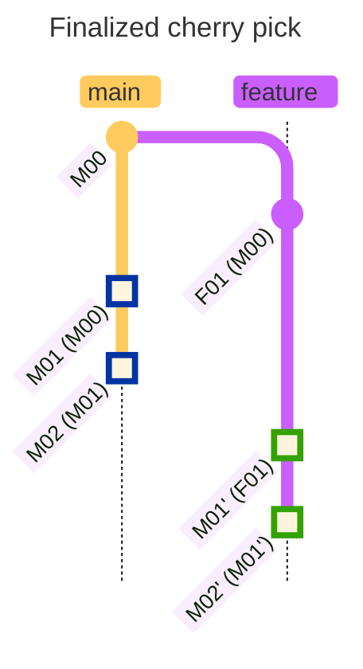

Changes to files of **individual** commits on branch `main` are replayed, merged and committed as **individual** commits on branch `feature`.

It's the same as if changes of individual commits were made and committed by a user.

# Rebase

Rebase branch `feature` onto `main`

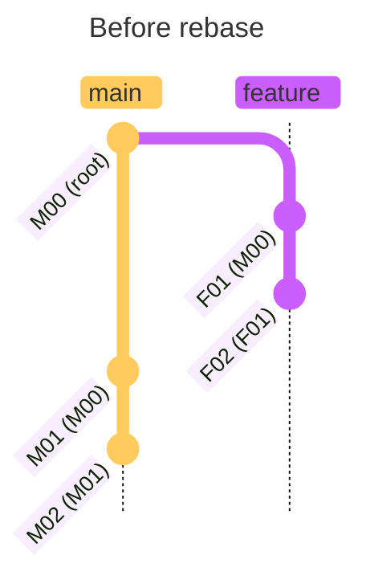

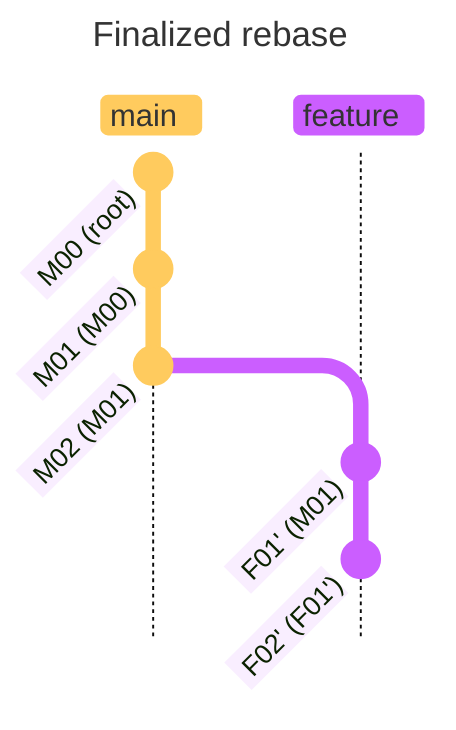

Internally (schematic, real code works slightly different)

* a temporary branch `feature_tmp` is created on commit `M02` of `main` branch
* the commits `F01` and `F02` are **cherry-picked** from `feature` branch into `feature_tmp`
* the `feature` branch is deleted
* the branch `feature_tmp` is renamed to `feaure`

# Squash

Squash the commits `M01` and `M02` to a single commit

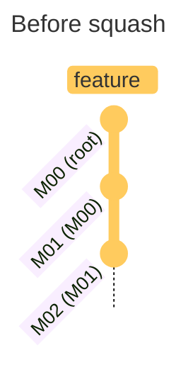

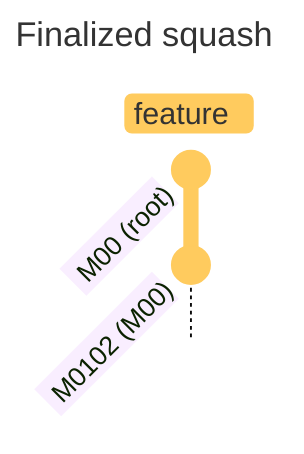

Internally (schematic, real code works slightly different)

* a temporary branch `main_tmp` is created on commit `M00` of `main` branch
* changes to files of **all** commits to squash are applied to `main_tmp` branch
* changes are committed as **single** commit `M0102`
* the `main` is deleted
* the branch `main_tmp` is renamed to `main`

# History rewriting

Rearrange and / or squash individual commits on a branch

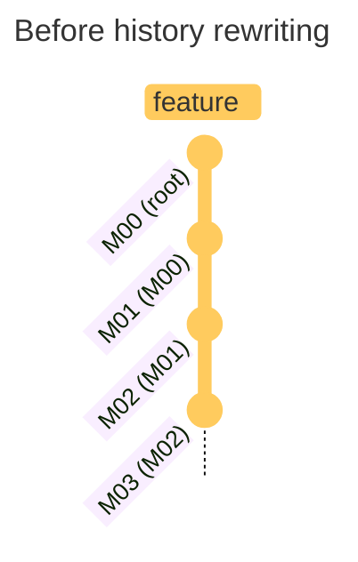

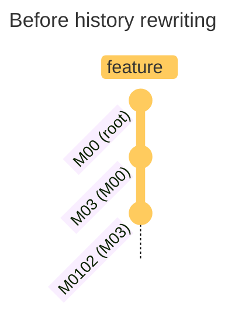

Internally, history rewriting is a forced rebase on any previous commit of the same branch.